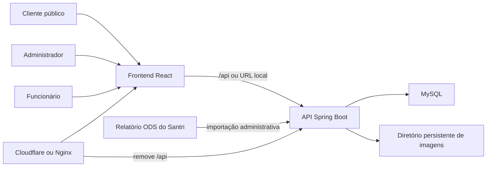

# Dubai Magazine Salvador

Catálogo digital da Dubai Magazine em Salvador, com catálogo público, administração de
produtos importados do Santri por planilha ODS e uma vitrine interna para atendimento na
loja física.

O projeto não realiza compras, pagamentos ou pedidos. O catálogo público apresenta os
itens disponíveis e direciona o cliente para atendimento ou compra presencial.

## Funcionalidades

- catálogo público com busca, categorias e paginação;
- preço de exibição calculado com o percentual de IPI recebido do Santri;
- seleção de produtos e vitrines de categoria na página inicial;
- três banners da home substituíveis diretamente pelo administrador;
- importação administrativa da Relação de Produtos Analítica em formato ODS;
- preservação das imagens, nomes públicos e decisões editoriais durante novas importações;
- administração da visibilidade, do nome público, da imagem e do destaque dos produtos;
- vitrine interna da loja física com variações, galeria de fotos e seções descritivas;
- acesso de funcionários somente para consulta da vitrine interna;
- cadastro de funcionários exclusivo para administradores;
- autenticação por código Santri e senha, com JWT e bloqueios contra tentativas repetidas;
- perfis separados para desenvolvimento, pré-produção e produção.

## Tecnologias

| Camada | Tecnologias principais |
|---|---|
| Frontend | React 18, TypeScript 5, Vite 8, React Router 7, TanStack Query, Axios, Bootstrap |
| Backend | Java 25, Spring Boot 4.1, Spring Security, Spring Data JPA, Bean Validation |
| Banco | MySQL 8, Flyway |
| Autenticação | JWT HMAC, BCrypt com custo 12 |
| Infraestrutura | Nginx ou proxy equivalente, Cloudflare Tunnel para pré-produção |
| Testes | JUnit 5, Mockito, Spring MVC Test, Spring Security Test |

## Arquitetura resumida



Em desenvolvimento, o frontend pode chamar o backend diretamente pela rede local. Em
pré-produção e produção, o navegador usa a mesma origem HTTPS do site e o proxy encaminha
`/api` para o Spring Boot em `127.0.0.1:8081`.

## Estrutura do repositório

```text
dubaiMagazineSalvador/
├── backend/                 API Spring Boot, migrations e testes
├── frontend/                aplicação React e assets públicos
├── deploy/                  exemplo de proxy Nginx e instruções de publicação
├── docs/                    documentação funcional e técnica
├── .env.example             modelo das variáveis privadas do backend
└── README.md                ponto de entrada da documentação
```

## Pré-requisitos

- Java 25;
- MySQL 8;
- Node.js compatível com Vite 8 — recomenda-se uma versão LTS atual;
- npm;
- PowerShell nos exemplos para Windows;
- `cloudflared` apenas para o fluxo opcional de pré-produção.

O Maven não precisa ser instalado globalmente porque o backend inclui Maven Wrapper.

## Início rápido em desenvolvimento

### 1. Banco de dados

Crie um banco vazio para desenvolvimento. As tabelas não devem ser criadas manualmente:
o Flyway executa as migrations quando a aplicação inicia.

Exemplo:

```sql
CREATE DATABASE catalogo_dubai
    CHARACTER SET utf8mb4
    COLLATE utf8mb4_unicode_ci;
```

### 2. Variáveis privadas

Na raiz do repositório, copie `.env.example` para `.env` e configure pelo menos:

```dotenv
DB_URL=jdbc:mysql://127.0.0.1:3306/catalogo_dubai
DB_USERNAME=usuario_local
DB_PASSWORD=senha_local
JWT_SECRET=gere_um_segredo_longo_aleatorio
SPRING_PROFILES_ACTIVE=development
```

O arquivo `.env` real é ignorado pelo Git. Nunca coloque credenciais nos arquivos
`frontend/.env.*`: toda variável `VITE_*` é incorporada ao JavaScript e fica pública no
navegador.

### 3. Backend

```powershell
cd backend
.\mvnw.cmd spring-boot:run
```

Por padrão, a API usa a porta `8081`. No primeiro início, o Flyway aplica todas as migrations
e o Hibernate apenas valida o esquema final.

### 4. Frontend

Confira o endereço em `frontend/.env.development` e execute:

```powershell
cd frontend
npm install
npm run dev
```

O Vite usa a porta `5173` em desenvolvimento.

## Primeiro administrador

`POST /auth/registerADM` exige um administrador já autenticado. Portanto, uma instalação com
banco totalmente vazio precisa de um provisionamento inicial controlado pela equipe responsável
pelo banco, usando uma senha previamente processada com BCrypt. A rota não deve ser aberta
temporariamente na internet para criar o primeiro acesso.

Depois do provisionamento inicial, os demais administradores podem ser criados pela rota
protegida e os funcionários pela área administrativa.

## Perfis de acesso

| Recurso | Público | Funcionário | Administrador |
|---|:---:|:---:|:---:|
| Catálogo e páginas institucionais | Sim | Sim | Sim |
| Login interno | Sim | Sim | Sim |
| Consulta da vitrine da loja física | Não | Sim | Sim |
| Dados internos completos de produtos | Não | Não | Sim |
| Importação ODS | Não | Não | Sim |
| Gerenciamento de vitrines | Não | Não | Sim |
| Cadastro de funcionários e administradores | Não | Não | Sim |

## Comandos de qualidade

Frontend:

```powershell
cd frontend
npm run lint
npm run build:preproduction
npm run build:production
```

Backend:

```powershell
cd backend
.\mvnw.cmd test
.\mvnw.cmd clean package
```

## Documentação detalhada

- [Arquitetura e módulos](docs/ARQUITETURA.md)
- [Modelo de dados e regras de catálogo](docs/MODELO_DE_DADOS.md)
- [Referência da API](docs/API.md)
- [Importação ODS do Santri](docs/IMPORTACAO_ODS.md)
- [Autenticação e segurança](docs/SEGURANCA.md)
- [Desenvolvimento, testes e manutenção](docs/DESENVOLVIMENTO.md)
- [Operação, ambientes e deploy](docs/OPERACAO_E_DEPLOY.md)
- [Instruções específicas do frontend](frontend/README.md)
- [Modelo de configuração Nginx](deploy/nginx/dubai-magazine.conf.example)

## Limites atuais do produto

- não existe carrinho, checkout, pedido ou pagamento;
- não existe cadastro ou login de cliente;
- a sincronização com o ERP depende de exportação e importação manual do ODS;
- imagens editoriais são administradas localmente e precisam de armazenamento persistente;
- banners e depoimentos da home são persistidos e editáveis por administradores;
- o projeto ainda não possui um mecanismo automático de bootstrap do primeiro administrador.

## Dados e propriedade

O repositório contém código e configuração do catálogo da Dubai Magazine. Credenciais,
planilhas reais, banco de dados e diretórios de imagens enviados em produção não devem ser
versionados.
