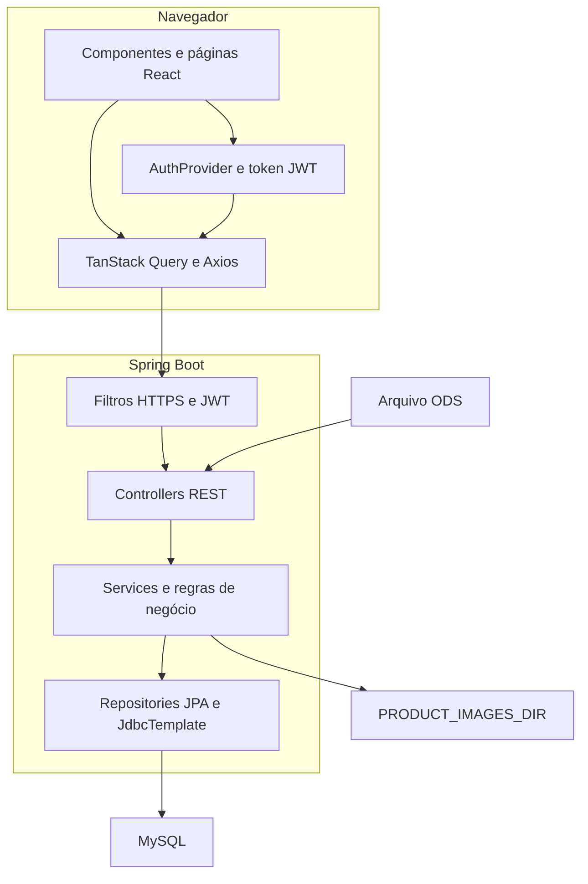
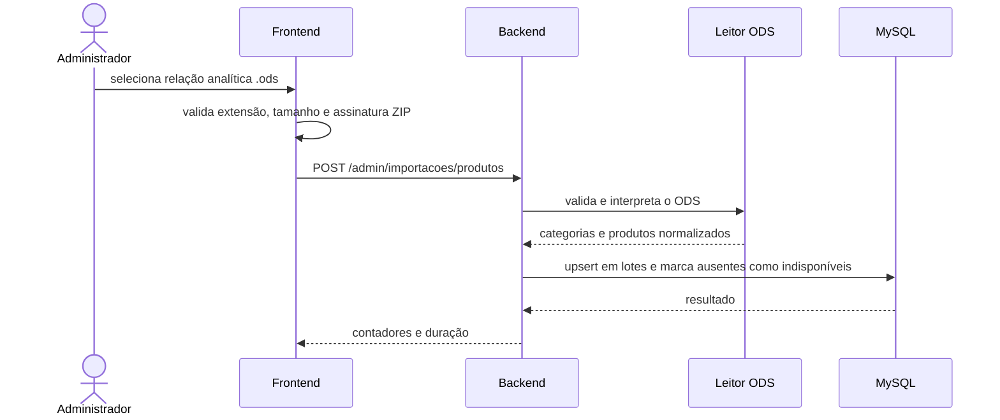

# Arquitetura e módulos

## Visão geral

A aplicação segue uma arquitetura cliente-servidor:

- o frontend React renderiza o catálogo, as páginas institucionais e as áreas internas;
- o backend Spring Boot concentra autenticação, autorização, regras de negócio, persistência,
  importação ODS e armazenamento de imagens;
- o MySQL mantém usuários, produtos, categorias e vitrines;
- o Flyway controla todas as mudanças de esquema;
- em ambientes publicados, um proxy entrega o frontend e encaminha `/api` ao backend.

O frontend protege a navegação para melhorar a experiência, mas a barreira de segurança real é
o Spring Security. Uma rota administrativa não se torna pública por ser chamada diretamente sem
passar pela interface.

## Componentes

## Backend

Pacote base:
`com.ecommerceproject.dubaimagazinesalvador`.

| Pacote | Responsabilidade |
|---|---|
| `controller` | contrato HTTP, parâmetros, status e seleção inicial do serviço |
| `domain` | entidades JPA e DTOs de entrada e saída |
| `repositories` | consultas e persistência com Spring Data JPA |
| `services` | regras de negócio, importação, login, imagens e vitrines |
| `infra.security` | JWT, HTTPS obrigatório, CORS e regras de acesso |
| `infra.config` | configuração web complementar |
| `db/migration` | evolução versionada do banco com Flyway |

### Catálogo

`Produto` concentra os dados recebidos do relatório analítico do Santri e os campos editoriais
do site. O catálogo público usa `ProdutoCatalogoPublicoDTO`, que contém apenas:

- identificador público aleatório;
- nome exibido no site;
- marca;
- preço com IPI;
- código, nome e caminho público da categoria;
- URLs públicas da galeria de até oito fotos.

Campos como código Santri, código de barras, estoque, NCM e dados logísticos só aparecem no DTO
administrativo.

### Importação

O fluxo da importação é dividido em duas responsabilidades:

1. `LeitorRelacaoProdutosOds` valida ZIP, MIME e XML e converte as linhas em DTOs;
2. `ImportacaoProdutosService` aplica as regras do catálogo e executa os upserts em lotes.

`ControleImportacaoProdutosService` impede duas importações simultâneas na mesma instância da
aplicação.

### Imagens

`ProdutoImagem` representa a galeria única do produto. Catálogo e vitrine física leem a mesma
coleção ordenada; a primeira posição é a foto principal e a segunda é o hover. A migration V23
converte as duas colunas antigas e as fotos já cadastradas na vitrine sem perder os arquivos.

`ArmazenamentoImagemProdutoService` armazena os arquivos dessa galeria. O serviço:

- limita o arquivo a 5 MB;
- valida extensão, MIME declarado e assinatura binária;
- renomeia o arquivo com UUID;
- grava no diretório configurado por `PRODUCT_IMAGES_DIR`;
- verifica dimensões e quantidade total de pixels, recusando links simbólicos;
- só permite leitura pública de nomes que seguem o formato gerado pela aplicação.

O banco guarda a referência; o conteúdo binário fica no sistema de arquivos. A rota pública usa
localização direta pelo UUID. Referências legadas contam com um índice montado uma vez, sem
varredura do diretório a cada requisição. O antigo mapeamento público `/uploads/**` foi removido.

`LimpezaImagensOrfasService` consulta as referências persistidas e remove arquivos gerenciados
órfãos com idade mínima padrão de 24 horas. A limpeza é agendada diariamente; ela não pertence
ao caminho de atendimento de uma requisição pública. Alterações editoriais coordenam a exclusão
de imagens antigas com a conclusão da transação no banco.

### Autenticação

O login usa `codigoSantri` e senha. Após autenticação, `TokenService` cria um JWT HMAC contendo:

- `sub`: UUID do usuário;
- `funcao`: papel do usuário;
- `iss`: `dubai-magazine-api`;
- `aud`: `dubai-magazine-interno`;
- `iat`, `jti` e `versao`: emissão, identificador do token e versão de sessão;
- expiração configurável entre 300 e 3.600 segundos, com padrão de 3.600.

Cada requisição protegida envia `Authorization: Bearer <token>`. O backend não cria sessão HTTP,
mas verifica o usuário no banco, incluindo `ativo` e `versaoToken`. Portanto, a sessão pode ser
revogada antes da expiração: logout incrementa a versão; alteração do estado de funcionário
também invalida tokens anteriores. O papel usado na autorização vem do usuário atual no banco.

### Proteções transversais

`LimitadorRequisicoesPublicasInterceptor` limita leituras de catálogo e imagens por origem, com
baldes e teto de memória separados. `FiltrosPesquisaCatalogo` normaliza os filtros e escapa os
curingas do `LIKE`; consultas públicas têm tamanho, paginação e duração delimitados. A migration
V26 melhora os índices de navegação por estado, ordem e categoria. Esses índices não transformam
busca por trecho (`LIKE '%termo%'`) em uma busca de texto indexada: acompanhe planos de execução
e latência quando a base crescer.

`AuditoriaAdministrativaInterceptor` registra metadados de mutações autenticadas por meio de
`AuditoriaAdministrativaService`. A trilha inclui ação, usuário, resultado e horário; IP e
User-Agent recebem HMAC. A retenção padrão é de 180 dias, com exclusão diária limitada por lote.

`PerfilExecucaoSeguro` exige exatamente um perfil conhecido. Em produção, conta de aplicação e
conta de migrations são configuradas separadamente. O Nginx complementa as regras do backend com
TLS, cabeçalhos, limites de requisições/conexões e validação do host público.

Pré-produção e produção usam `server.forward-headers-strategy=native`: o `RemoteIpValve` do
Tomcat processa `X-Forwarded-For`, protocolo e porta somente de conexões vindas de loopback. O
proxy sobrescreve esses cabeçalhos antes de encaminhar; mudar sua topologia exige revisar essa
lista de confiança.

## Frontend

| Diretório | Responsabilidade |
|---|---|
| `components` | elementos reutilizáveis e editores menores |
| `pages` | telas ligadas às rotas principais |
| `hooks` | consultas, mutations e integração com API |
| `context` | autenticação global |
| `interface` | tipos TypeScript dos contratos da API |
| `utils` | imagens, arquivos, dispositivo e categorias internas |
| `public/assets` | marca, banners, ícones e imagens estáticas |

Os três banners editáveis da home não ficam em `public/assets`: as posições são persistidas no
banco e os arquivos enviados ficam no diretório externo `PRODUCT_IMAGES_DIR`.

### Rotas do navegador

| Rota | Acesso | Finalidade |
|---|---|---|
| `/` | público | home |
| `/produtos` | público | catálogo, filtros e busca |
| `/produtos/:idPublico` | público | detalhe, galeria e descrição do produto |
| `/quem-somos` | público | conteúdo institucional |
| `/politica-de-privacidade` | público | política e termos |
| `/contato` | público | canais e endereço |
| `/trocas-e-devolucoes` | público | política comercial |
| `/admin` | público | formulário de login interno |
| `/minha-conta` | administrador | menu administrativo |
| `/admin/funcionarios` | administrador | cadastro, listagem e ativação/desativação de funcionário |
| `/admin/importacao-produtos` | administrador | importação da relação de produtos ODS |
| `/admin/importacao-promocoes` | administrador | importação das promoções ODS |
| `/admin/importacao-estoque` | administrador | atualização do estoque pelo inventário ODS |
| `/admin/vitrines-home` | administrador | CRUD das vitrines da home |
| `/admin/vitrine-loja` | administrador | CRUD da vitrine física |
| `/vitrine-loja` | funcionário ou administrador | consulta interna |

`RotaAdmin` e `RotaVitrineInterna` fazem o redirecionamento visual. O backend repete e impõe as
mesmas permissões. As três telas de importação oferecem retorno direto ao menu `/minha-conta`,
além dos atalhos operacionais entre catálogo e importações.

### Estado e comunicação

- o token é mantido em `sessionStorage`;
- `AuthProvider` descarta token inválido ou expirado ao iniciar;
- o interceptor do Axios inclui o Bearer token;
- respostas `401` encerram a sessão local; logout também solicita revogação ao backend;
- Bearer só acompanha a origem e o prefixo da API; URLs externas não recebem o token;
- cookies e `withCredentials` ficam desativados;
- TanStack Query mantém cache e invalida produtos e vitrines após alterações;
- login, logout e expiração limpam o cache inteiro para separar dados de sessões distintas;
- os filtros do catálogo ficam na query string, permitindo links diretos.
- categoria, busca e faixa de preço são aplicadas na consulta JPA antes do `PageRequest`, para que
  a contagem e a navegação representem o conjunto filtrado inteiro.

## Fluxos principais

### Atualização do catálogo

### Publicação de foto na vitrine física

1. o administrador adiciona um card de foto;
2. o navegador valida e mostra uma prévia local;
3. ao salvar, o arquivo é enviado para `/admin/vitrine-loja/imagens`;
4. o backend valida novamente, armazena e devolve uma URL pública;
5. a URL é incluída na galeria compartilhada do `Produto`;
6. catálogo e vitrine invalidam seus caches e passam a ler a mesma ordem de fotos.

## Decisões importantes

- dados operacionais vêm do ODS; alterações manuais do administrador são editoriais;
- `nomeExibidoSite` só acompanha o nome do Santri enquanto não foi personalizado;
- uma nova importação não apaga produtos ausentes, mas os torna indisponíveis e ocultos;
- produtos e categorias de ativo imobilizado são removidos do catálogo;
- a vitrine física não é uma página de compra;
- variações de cor ou modelo são representadas por produtos distintos dentro da mesma vitrine;
- descrições do catálogo usam uma marcação restrita, renderizada sem HTML livre;
- banners e depoimentos da home são configurações editoriais persistidas no backend.

## Pontos de extensão

- substituir a importação ODS por integração oficial com o ERP sem alterar os DTOs públicos;
- mover imagens para armazenamento de objetos mantendo o contrato de URL pública;
- criar bootstrap operacional auditável para o primeiro administrador;
- adicionar observabilidade centralizada e persistência distribuída do rate limit;
- criar testes automatizados de componentes e fluxos completos do frontend.
