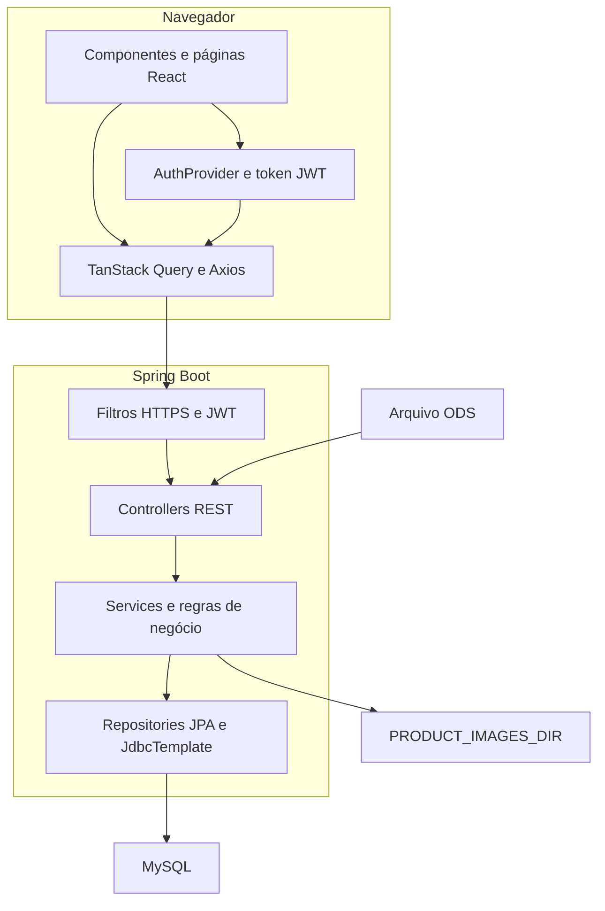
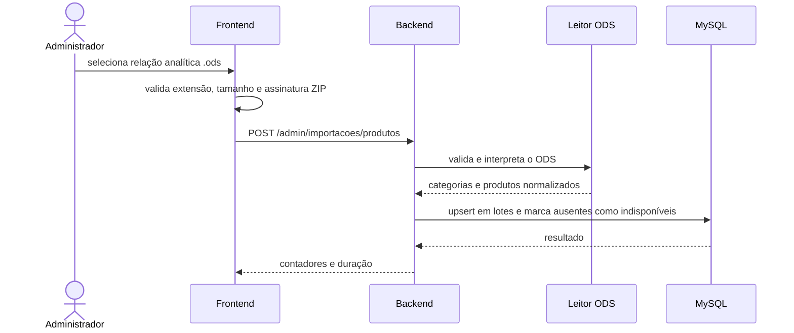

# Arquitetura e módulos

## Visão geral

A aplicação segue uma arquitetura cliente-servidor:

- o frontend React renderiza o catálogo, as páginas institucionais e as áreas internas;
- o backend Spring Boot concentra autenticação, autorização, regras de negócio, persistência,
  importação ODS e armazenamento de imagens;
- o MySQL mantém usuários, produtos, categorias e vitrines;
- o Flyway controla todas as mudanças de esquema;
- em ambientes publicados, um proxy entrega o frontend e encaminha `/api` ao backend.

O frontend protege a navegação para melhorar a experiência, mas a barreira de segurança real é
o Spring Security. Uma rota administrativa não se torna pública por ser chamada diretamente sem
passar pela interface.

## Componentes

## Backend

Pacote base:
`com.ecommerceproject.dubaimagazinesalvador`.

| Pacote | Responsabilidade |
|---|---|
| `controller` | contrato HTTP, parâmetros, status e seleção inicial do serviço |
| `domain` | entidades JPA e DTOs de entrada e saída |
| `repositories` | consultas e persistência com Spring Data JPA |
| `services` | regras de negócio, importação, login, imagens e vitrines |
| `infra.security` | JWT, HTTPS obrigatório, CORS e regras de acesso |
| `infra.config` | configuração web complementar |
| `db/migration` | evolução versionada do banco com Flyway |

### Catálogo

`Produto` concentra os dados recebidos do relatório analítico do Santri e os campos editoriais
do site. O catálogo público usa `ProdutoCatalogoPublicoDTO`, que contém apenas:

- nome exibido no site;
- marca;
- preço com IPI;
- código, nome e caminho público da categoria;
- URL pública da imagem.

Campos como código Santri, código de barras, estoque, NCM e dados logísticos só aparecem no DTO
administrativo.

### Importação

O fluxo da importação é dividido em duas responsabilidades:

1. `LeitorRelacaoProdutosOds` valida ZIP, MIME e XML e converte as linhas em DTOs;
2. `ImportacaoProdutosService` aplica as regras do catálogo e executa os upserts em lotes.

`ControleImportacaoProdutosService` impede duas importações simultâneas na mesma instância da
aplicação.

### Imagens

`ArmazenamentoImagemProdutoService` é usado tanto para a imagem principal de produto quanto para
as galerias da vitrine física. O serviço:

- limita o arquivo a 5 MB;
- valida extensão, MIME declarado e assinatura binária;
- renomeia o arquivo com UUID;
- grava no diretório configurado por `PRODUCT_IMAGES_DIR`;
- só permite leitura pública de nomes que seguem o formato gerado pela aplicação.

O banco guarda a referência; o conteúdo binário fica no sistema de arquivos.

### Autenticação

O login usa `codigoSantri` e senha. Após autenticação, `TokenService` cria um JWT HMAC contendo:

- `sub`: UUID do usuário;
- `funcao`: papel do usuário;
- `iss`: `auth-api`;
- expiração configurável, com padrão de 3.600 segundos.

O backend não cria sessão de servidor. Cada requisição protegida envia
`Authorization: Bearer <token>`.

## Frontend

| Diretório | Responsabilidade |
|---|---|
| `components` | elementos reutilizáveis e editores menores |
| `pages` | telas ligadas às rotas principais |
| `hooks` | consultas, mutations e integração com API |
| `context` | autenticação global |
| `interface` | tipos TypeScript dos contratos da API |
| `utils` | imagens, arquivos, dispositivo e categorias internas |
| `public/assets` | marca, banners, ícones e imagens estáticas |

Os três banners editáveis da home não ficam em `public/assets`: as posições são persistidas no
banco e os arquivos enviados ficam no diretório externo `PRODUCT_IMAGES_DIR`.

### Rotas do navegador

| Rota | Acesso | Finalidade |
|---|---|---|
| `/` | público | home |
| `/produtos` | público | catálogo, filtros e busca |
| `/quem-somos` | público | conteúdo institucional |
| `/politica-de-privacidade` | público | política e termos |
| `/contato` | público | canais e endereço |
| `/trocas-e-devolucoes` | público | política comercial |
| `/admin` | público | formulário de login interno |
| `/minha-conta` | administrador | menu administrativo |
| `/admin/funcionarios` | administrador | cadastro de funcionário |
| `/admin/importacao-produtos` | administrador | importação ODS |
| `/admin/vitrines-home` | administrador | CRUD das vitrines da home |
| `/admin/vitrine-loja` | administrador | CRUD da vitrine física |
| `/vitrine-loja` | funcionário ou administrador | consulta interna |

`RotaAdmin` e `RotaVitrineInterna` fazem o redirecionamento visual. O backend repete e impõe as
mesmas permissões.

### Estado e comunicação

- o token é mantido em `localStorage`;
- `AuthProvider` descarta token inválido ou expirado ao iniciar;
- o interceptor do Axios inclui o Bearer token;
- cookies e `withCredentials` ficam desativados;
- TanStack Query mantém cache e invalida produtos e vitrines após alterações;
- os filtros do catálogo ficam na query string, permitindo links diretos.

## Fluxos principais

### Atualização do catálogo

### Publicação de foto na vitrine física

1. o administrador adiciona um card de foto;
2. o navegador valida e mostra uma prévia local;
3. ao salvar, o arquivo é enviado para `/admin/vitrine-loja/imagens`;
4. o backend valida novamente, armazena e devolve uma URL pública;
5. a URL é incluída no JSON da vitrine;
6. a consulta interna resolve a URL pela mesma origem da API.

## Decisões importantes

- dados operacionais vêm do ODS; alterações manuais do administrador são editoriais;
- `nomeExibidoSite` só acompanha o nome do Santri enquanto não foi personalizado;
- uma nova importação não apaga produtos ausentes, mas os torna indisponíveis e ocultos;
- produtos e categorias de ativo imobilizado são removidos do catálogo;
- a vitrine física não é uma página de compra;
- variações de cor ou modelo são representadas por produtos distintos dentro da mesma vitrine;
- banners e depoimentos da home são configurações editoriais persistidas no backend.

## Pontos de extensão

- substituir a importação ODS por integração oficial com o ERP sem alterar os DTOs públicos;
- mover imagens para armazenamento de objetos mantendo o contrato de URL pública;
- criar bootstrap operacional auditável para o primeiro administrador;
- adicionar observabilidade centralizada e persistência distribuída do rate limit;
- criar testes automatizados de componentes e fluxos completos do frontend.
