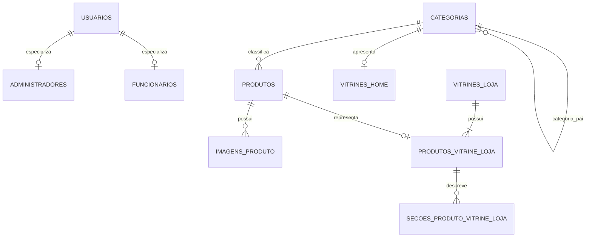

# Modelo de dados e regras de catálogo

## Convenções

- chaves de usuário são UUIDs persistidos como `VARCHAR(36)`;
- o código Santri identifica produtos e contas internas;
- códigos hierárquicos de categoria podem ter até quatro níveis;
- datas de auditoria da vitrine usam precisão de microssegundos;
- valores monetários usam `DECIMAL`/`BigDecimal`, nunca `double`;
- o esquema é criado e evoluído exclusivamente pelo Flyway.

## Relacionamentos



## Usuários

### `usuarios`

Armazena os campos comuns de autenticação:

- UUID;
- código Santri único;
- hash BCrypt da senha;
- função `ROLE_ADMIN`, `ROLE_FUNCIONARIO` ou legado `ROLE_CLIENTE`;
- quantidade de falhas consecutivas;
- instante até o qual a conta permanece bloqueada.

O e-mail foi removido do modelo atual de autenticação. O login é exclusivamente pelo código
Santri.

### `administradores` e `funcionarios`

São especializações um-para-um de `usuarios`. Guardam dados cadastrais como nome, CPF, sexo,
data de nascimento, CEP, bairro e telefone. Administradores também possuem endereço.

As tabelas e a entidade legada de cliente ainda existem por histórico de migrations, mas suas
rotas são negadas e o produto atual não oferece cadastro nem login de cliente.

## Categorias

`categorias` possui:

| Campo | Uso |
|---|---|
| `codigo` | identificador hierárquico vindo do relatório |
| `nome` | nome do nível atual |
| `nivel` | valor de 1 a 4 |
| `caminho` | caminho legível completo |
| `categoria_pai_codigo` | autorrelacionamento para o nível anterior |
| `exibir_no_site` | decisão de disponibilidade pública |

Exemplo de árvore:

```text
001 Utilidades
└── 001.010 Cozinha
    └── 001.010.020 Panelas
```

### Grupos com tratamento especial

| Código raiz | Tratamento atual |
|---|---|
| `008` — Uso e Consumo | ocultado pela interface pública do catálogo |
| `089` — Ativo Imobilizado | produtos e categorias removidos durante a importação |
| `123` — Ajustes de Grupos | mantido para administração, ocultado do público |
| `999` — Implantação | mantido para administração, ocultado do público |

As regras abrangem o código raiz e todos os descendentes, por exemplo `123.001`.

## Produtos

`produtos.codigo_santri` é a chave primária. Os campos estão divididos em dois grupos.

### Dados sincronizados do Santri

- nome original e nome de compra;
- NCM, fabricante e marca;
- estado ativo e bloqueio para compras;
- unidades de venda e compra;
- data de cadastro, código original e código de barras;
- estoque;
- preço sem IPI e percentual de IPI de entrada;
- peso, altura, largura, comprimento e volume da unidade;
- peso e dimensões da caixa;
- origem, indicadores de industrializado e insumo;
- percentual máximo de aproveitamento de IPI e número FCI;
- categoria;
- instante e disponibilidade da última importação.

### Promoções

Os campos `em_promocao`, `data_inicial_prom`, `data_final_prom`, `porc_margem`, `porc_desconto`,
`preco_promocao` e `especial` vêm do relatório de Promoções de Venda. A vigência exibida é calculada
com a data atual, evitando que um preço vencido continue público mesmo antes da próxima importação.

### Dados editoriais da aplicação

- `id_publico`, UUID usado nas URLs públicas sem revelar o código Santri;
- `nome_exibido_site`;
- `descricao_site`, com a descrição única da página detalhada;
- `exibir_no_site`;
- `destaque_na_home`.

Esses campos editoriais não são substituídos indiscriminadamente pela importação. O nome público
só volta a acompanhar o Santri quando ainda está vazio ou igual ao nome anterior.

### `imagens_produto`

É a galeria editorial única do produto, com no máximo oito registros ordenados. A primeira posição
é a imagem normal do card e a segunda é exibida no hover; a página detalhada e a vitrine física
consomem a coleção completa. Assim, uma edição feita em qualquer uma das telas é refletida nas
demais. As colunas antigas `imagem_url` e `imagem_hover_url` permanecem apenas para compatibilidade
com dados anteriores e foram migradas para essa galeria pela V23.

`descricao_site` aceita somente a marcação controlada da aplicação para negrito, lista e tamanho
de fonte. O frontend converte essa marcação em elementos React, sem executar HTML armazenado.

### Preço com IPI

O banco mantém o preço sem IPI e o percentual recebido. O preço público é calculado em memória:

```text
preço com IPI = preço sem IPI × (1 + percentual IPI / 100)
```

O resultado é arredondado para duas casas com `HALF_UP`.

### Produto público

Um produto entra na consulta pública quando:

- `exibir_no_site = true`;
- `disponivel_ultima_importacao = true`;
- atende à categoria, busca e destaque solicitados.

O DTO público não expõe campos operacionais como estoque, código Santri ou código de barras.
Administradores e funcionários usam um contrato interno mínimo que acrescenta somente o código
Santri necessário à consulta; o DTO administrativo completo continua exclusivo do administrador.

## Vitrines da home

Cada registro de `vitrines_home` referencia uma categoria única e guarda:

- título;
- descrição;
- ordem;
- estado ativo.

A resposta pública associa até quatro produtos visíveis daquela árvore de categoria. A interface
apresenta os itens de forma rotativa.

## Banners da home

`banners_home` possui exatamente três posições, criadas pela migration. Cada posição guarda a URL
da imagem escolhida pelo administrador. Enquanto a URL estiver vazia, o frontend utiliza o banner
padrão correspondente.

As imagens ficam em `PRODUCT_IMAGES_DIR`, e o banco armazena somente a URL pública com UUID. Ao
substituir um banner, a aplicação remove o arquivo anterior quando ele foi gerado pelo próprio
sistema.

## Depoimentos da home

`depoimentos_home` possui exatamente três posições. Cada registro armazena o nome exibido do
cliente, limitado a 80 caracteres, e o texto do depoimento, limitado a 300 caracteres. A leitura é
pública, mas a atualização das três posições exige autenticação de administrador e ocorre em uma
única transação.

## Vitrine da loja física

### `vitrines_loja`

Agrupa uma apresentação interna e controla se ela está ativa para funcionários.

### `produtos_vitrine_loja`

Cada opção referencia um produto real e possui rótulo e ordem. Uma vitrine pode representar
variações como cores ou capacidades usando produtos diferentes. Um produto não pode estar em
duas vitrines.

Limites da regra de negócio:

- até 20 opções por vitrine;
- até 8 imagens compartilhadas por produto;
- até 30 seções por opção;
- rótulo com até 100 caracteres;
- título de seção com até 180 caracteres;
- conteúdo de seção com até 10.000 caracteres;
- vitrine ativa exige ao menos uma seção em cada opção.

### Imagens e seções

A vitrine não mantém uma galeria independente. Cada opção utiliza `imagens_produto`, pertencente
ao produto referenciado. Ao salvar uma edição, a versão original da lista é enviada para impedir
que um formulário antigo sobrescreva imagens alteradas simultaneamente em outra tela.

`secoes_produto_vitrine_loja` guarda blocos de título e texto, como resumo, motor, consumo,
dimensões e características. O modelo não fixa esses títulos, permitindo representar produtos
além de veículos.

## Comportamento da sincronização ODS

- categorias e produtos existentes são atualizados por chave;
- novos registros são inseridos;
- a gravação é feita em lotes de 1.000;
- produtos ausentes na importação não são apagados;
- produtos ausentes recebem `disponivel_ultima_importacao = false`, são ocultados e deixam de ser
  destaque;
- produtos que reaparecem voltam a ficar disponíveis, mas a decisão editorial de exibição é
  preservada quando aplicável;
- preço sem valor positivo força ocultação;
- ativo imobilizado é removido;
- ajustes de grupos e implantação permanecem ocultos.

## Migrations

| Versão | Objetivo |
|---|---|
| V1 | criação de usuários |
| V2 | estrutura legada de clientes |
| V3 | funcionários |
| V4 | administradores |
| V5 | categorias hierárquicas |
| V6 | estrutura inicial de produtos |
| V7 | destaque de produto na home |
| V8 | vitrines da home |
| V9 | regras iniciais de categorias internas |
| V10 | nome exibido no site |
| V11 | vitrine da loja física, imagens e seções |
| V12 | adaptação de produtos ao relatório analítico |
| V13 | correções de visibilidade pública |
| V14 | controle de falhas e bloqueio de login |
| V15 | autenticação por código Santri e remoção de e-mail |
| V16 | criação e preenchimento das três posições de banners da home |
| V17 | criação e preenchimento dos três depoimentos persistentes da home |
| V18 | controle transacional do limite de três produtos na Seleção da Loja |
| V19 | compatibilidade do identificador do controle da Seleção da Loja com JPA |
| V20 | remoção de destaques ocultos ou indisponíveis da Seleção da Loja |
| V21 | dados de preço e período das promoções de venda |
| V22 | segunda imagem do produto para hover no catálogo |
| V23 | identificador público, descrição e galeria compartilhada de até oito fotos |

Nunca altere uma migration que já foi aplicada em um ambiente compartilhado. Toda mudança futura
de esquema deve ser criada em uma nova migration posterior à V23.

## Recriação do banco

Em desenvolvimento, um banco descartável pode ser recriado do zero e o Flyway reaplicará todas
as migrations. Em produção, apagar o banco não é uma estratégia de atualização. Faça backup e
deixe o Flyway aplicar somente as versões pendentes.
